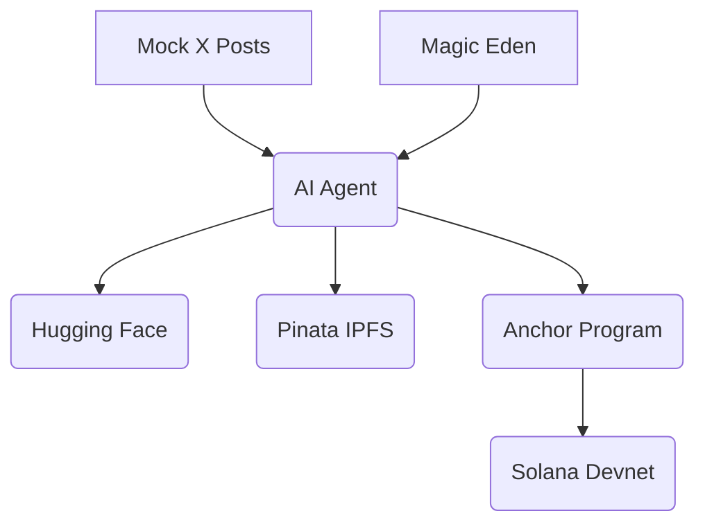

---
# Slidev frontmatter configuration
theme: default
title: Introduction to NFT-AI on Solana
titleTemplate: '%s - Slidev'
presenter: true
download: true
exportFilename: nft-ai-solana
info: AI-Driven NFT Art Gallery Demo with Rust/TypeScript
background: images/background.png
transition: fade
---

# Introduction to NFT-AI on Solana

AI-Driven NFT Art Gallery

- **Audience**: Developers familiar with AI/NFTs
- **Goal**: Build an NFT gallery with Rust/TypeScript
- **Topics**: Coded demo, AI-agent interaction, scaling/security

Presented by: pupplecat

---
layout: center
notes: Highlight Solana’s speed and code-driven control
transition: fade
---

# Why Solana and Code?

**Solana**:
- 65,000+ TPS
- ~$0.00025 per transaction
- Ideal for scalable NFTs

**AI-Driven**:
- Generate art and analyze sentiment with Hugging Face
- Autonomous NFT management via AI agents
- Real-time AI on Solana with Pinata, Magic Eden

<v-click>
Let’s code an AI-driven NFT gallery!
</v-click>

---
layout: two-cols
notes: Show how Rust and TypeScript integrate
transition: fade
---

# AI-Driven NFT Gallery Use Case

**Tech Stack**:
- **Rust/Anchor**: Smart contracts for minting/updating
- **TypeScript**: Client for AI, IPFS, marketplace
- **Hugging Face**: AI art and sentiment analysis
- **Pinata IPFS**: Metadata storage
- **Magic Eden Devnet**: Marketplace simulation

::right::


<v-click>
<br/><br/><br/>
<b>Workflow</b>:
<br/><br/>

1. Generate AI art (“futuristic city”) <br/>
2. Upload to IPFS <br/>
3. Mint NFT with Metaplex <br/>
4. Update metadata (Popularity: High) <br/>
5. Simulate listing (1 SOL) <br/>
<br/>

</v-click>

---
notes: Demo JSON schema; explain TypeScript agent
transition: fade
---

# Letting AI Know Agent Methods

**Goal**: AI understands and calls agent methods (mint, update, list)

**Approach**:
- Define methods in `src/agent.ts`
- Expose via JSON schemas

```json
{
  "name": "mint_nft",
  "description": "Mint a new NFT",
  "parameters": {
    "name": { "type": "string" },
    "image_url": { "type": "string" }
  }
}
```

<v-click>
- AI script (`main.ts`) selects methods based on inputs
- Example: “Mint NFT, Name: AI Art” → Anchor call
</v-click>

---
layout: two-cols
notes: Show Mermaid; discuss mainnet costs
transition: fade
---

# Scaling and Securing NFT-AI Agents

**Scaling**:
- Batch minting with Anchor
- Real-time AI via Hugging Face
- Solana’s 65,000+ TPS
- Solana Agent Kit for advanced agents

**Security**:
- Wallet encryption
- Transaction validation in Anchor
- Metadata on IPFS/Arweave
- Monitor via logs

::right::



<v-click>
- Mainnet: ~0.01 SOL for 100 mints
</v-click>

---
layout: two-cols
notes: Run npm commands live; show Solana Explorer
transition: fade
---

# Live Demo

**Watch the AI-driven NFT gallery in action!**

**Steps**:
1. Generate art: `yarn generate-art "futuristic city"`
2. Upload to IPFS: `yarn upload-ipfs`
3. Mint NFT: `yarn mint-nft`
4. Update metadata: `yarn update-metadata`
5. Simulate listing: `yarn list-nft`
6. View on Solana Explorer


::right::

<br/><br/><br/>

<br/>
https://github.com/pupplecat/nft-ai-gallery
<br/>
<br/>


---
layout: center
notes: Metaplex Asset Signer
transition: fade
---

**Metaplex Asset Signer:** Key Summaries

- **Execute Asset Signing**: Enables NFTs to act as autonomous agents, signing transactions via the Asset Signer PDA.

- **Asset Signer PDA**: Unique PDA derived from the NFT’s asset account, controlled by Metaplex Core, signs actions without a private key.

- **Execute Instruction**: Triggers Metaplex Core to validate and execute NFT actions (e.g., listing, updating metadata).

- **External Signer**: Authorized entity (owner, delegate, plugin authority) submits off-chain transaction to invoke Execute.

- **Validation & Signing**: Program validates signer and plugin logic, signs action with Asset Signer PDA via invoke_signed.

- **Autonomy**: Supports programmable NFT actions, often AI-driven, for marketplaces, DeFi, and more.

- **Security**: Separates external signer (transaction submission) from Asset Signer PDA (action signing).

---
layout: center
notes: Encourage questions on mainnet, Anchor
transition: fade
---

# Q&A

**Ask away!**
- Scaling to mainnet?
- Advanced Anchor programs?
- Real Magic Eden integration?


