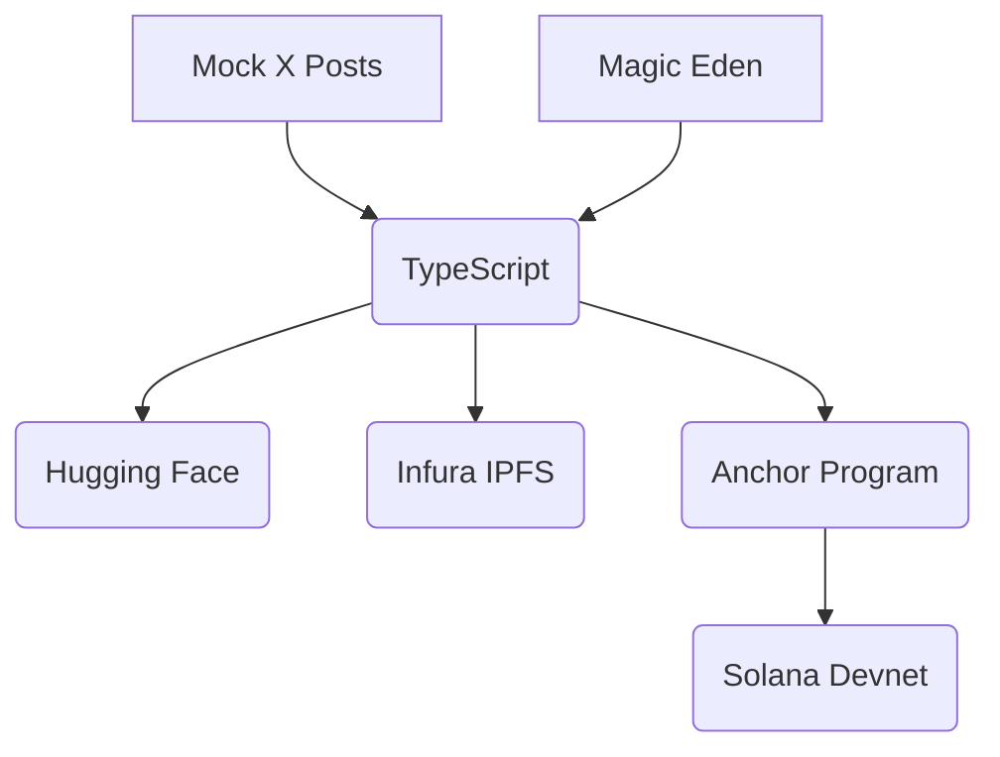

---
# Slidev frontmatter configuration
theme: default
title: Introduction to NFT-AI on Solana
titleTemplate: '%s - Slidev'
presenter: true
download: true
exportFilename: nft-ai-solana
info: AI-Driven NFT Art Gallery Demo with Rust/TypeScript
background: images/background.png
---

# Introduction to NFT-AI on Solana

AI-Driven NFT Art Gallery

- **Audience**: Developers familiar with AI/NFTs
- **Goal**: Build an NFT gallery with Rust/TypeScript
- **Topics**: Coded demo, AI-agent interaction, scaling/security

Presented by: [Your Name]

---
layout: center
notes: Highlight Solana’s speed and code-driven control
---

# Why Solana and Code?

**Solana**:
- 65,000+ TPS
- ~$0.00025 per transaction
- Ideal for scalable NFTs

**Code-Driven**:
- Full control with Rust/Anchor
- TypeScript for client interactions
- Tools: Hugging Face, Infura, Magic Eden

<v-click>
Let’s code an AI-driven NFT gallery!
</v-click>

---
layout: two-cols
notes: Show how Rust and TypeScript integrate
---

# AI-Driven NFT Gallery Use Case

**Tech Stack**:
- **Rust/Anchor**: Smart contracts for minting/updating
- **TypeScript**: Client for AI, IPFS, marketplace
- **Hugging Face**: AI art and sentiment analysis
- **Infura IPFS**: Metadata storage
- **Magic Eden Devnet**: Marketplace simulation

::right::

**Workflow**:
<v-click>
1. Generate AI art (“futuristic city”)
2. Upload to IPFS
3. Mint NFT with Metaplex
4. Update metadata (Popularity: High)
5. Simulate listing (1 SOL)
</v-click>


---
notes: Demo JSON schema; explain TypeScript agent
---

# Letting AI Know Agent Methods

**Goal**: AI understands and calls agent methods (mint, update, list)

**Approach**:
- Define methods in `src/agent.ts`
- Expose via JSON schemas

```json
{
  "name": "mint_nft",
  "description": "Mint a new NFT",
  "parameters": {
    "name": { "type": "string" },
    "image_url": { "type": "string" }
  }
}
```

<v-click>
- AI script (`main.ts`) selects methods based on inputs
- Example: “Mint NFT, Name: AI Art” → Anchor call
</v-click>

---
layout: two-cols
notes: Show Mermaid; discuss mainnet costs
---

# Scaling and Securing NFT-AI Agents

**Scaling**:
- Batch minting with Anchor
- Real-time AI via Hugging Face
- Solana’s 65,000+ TPS
- Solana Agent Kit for advanced agents

**Security**:
- Wallet encryption
- Transaction validation in Anchor
- Metadata on IPFS/Arweave
- Monitor via logs

::right::



<v-click>
- Mainnet: ~0.01 SOL for 100 mints
</v-click>

---
layout: center
notes: Run npm commands live; show Solana Explorer
---

# Live Demo

**Watch the AI-driven NFT gallery in action!**

**Steps**:
1. Generate art: `npm run generate-art`
2. Upload to IPFS: `npm run upload-ipfs`
3. Mint NFT: `npm run mint-nft`
4. Update metadata: `npm run update-metadata`
5. Simulate listing: `npm run list-nft`
6. View on Solana Explorer


---
layout: center
notes: Share QR code; explain README setup
---

# Attendee Participation

**Try it yourself in ~20 minutes!**

**Steps**:
- Clone repo: [insert GitHub repo URL]
- Set up: Docker or local (Rust, Node.js)
- Run demo: `npm run mint-nft`, etc.
- Follow README for details

**QR Code**:


---
layout: two-cols
notes: Encourage questions on mainnet, Anchor
---

# Q&A

**Ask away!**
- Scaling to mainnet?
- Advanced Anchor programs?
- Real Magic Eden integration?

::right::

**Resources**:
- Slides: [insert GitHub Pages/PDF link]
- Repo: [insert GitHub repo URL]
- Discord: [insert Discord link]
- Email: [insert email]


---
layout: end
---

# Thank You!

**Let’s build the future of NFT-AI on Solana!**

- Try the demo: [insert GitHub repo URL]
- Connect: [insert Discord link], [insert email]
- Slides: [insert GitHub Pages/PDF link]

---